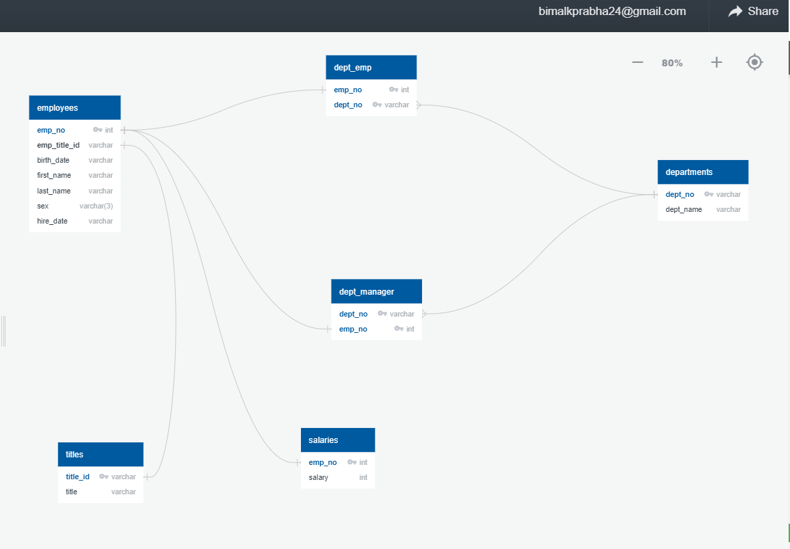
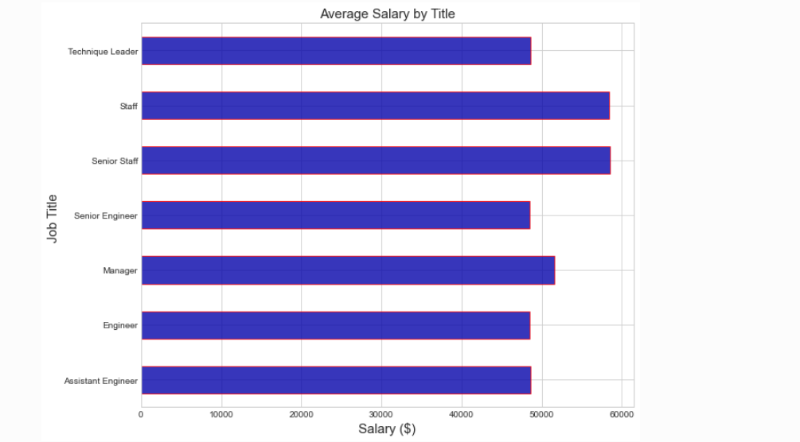
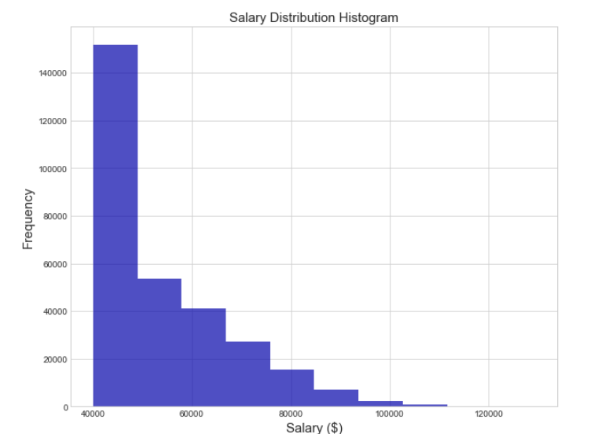
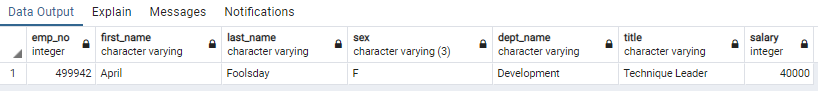

  

<h3 align="center">Data Engineering with postgreSQL and Pandas </h3>

---

  A project on design the  of ERD(Entity-Relationship-Diagram) and tables to hold data from the CSVs, importing the CSVs into a SQL database, and analysisng the data. In other words, I will perform:
  

## 📝 Table of Contents

- [Team](#Team)
- [About](#about)
- [Getting Started](#getting_started)
- [Bonus](#bonus)
- [Acknowledgments](#acknowledgement)

## 🧐 About 

Data Modeling  
- Inspecting the CSVs and sketched out an ERD of the tables by use a tool like http://www.quickdatabasediagrams.com.
Data Engineering  
Creating a table schema for each of the six CSV files.Specified data types, primary keys, foreign keys, and other constraints.  
For the primary keys checked to see if the column is unique, otherwise created a composite key. Which takes two primary keys in order to uniquely identify a row.  
Created tables in the correct order to handle foreign keys.Importe each CSV file into the corresponding SQL table. Imported the data in the same order that the tables were  created and accounted for the headers when importing to avoid errors.

### Summary
1. Listed the following details of each employee: employee number, last name, first name, sex, and salary.  
2. Listed first name, last name, and hire date for employees who were hired in 1986.  
3. Listed the manager of each department with the following information: department number, department name, the manager's employee number, last name, first name.  
4. Listed the department of each employee with the following information: employee number, last name, first name, and department name.  
5. Listed first name, last name, and sex for employees whose first name is "Hercules" and last names begin with "B."  
6. Listed all employees in the Sales department, including their employee number, last name, first name, and department name.  
7. Listed all employees in the Sales and Development departments, including their employee number, last name, first name, and department name.  

## 🏁 Getting Started 

#### ERD - Diagram  

  

ERD Diagram establishing the realtionship between the tables.  

## Bonus Part -Importing the SQL database into Pandas. 

A bar chart of average salary by title.  

  

Histogram to visualize the most common salary ranges for employees. 

  

### Epilogue 
I look down at my badge to see that my employee ID number is 499942.
It shows the first and last name april foolsday.I have been tricked.

  

## 🎉 Acknowledgements 
- UWA Data Science
